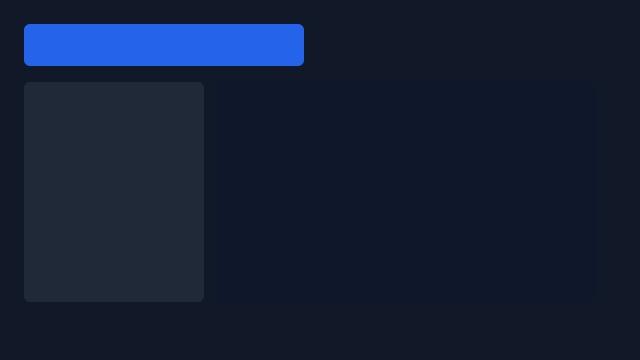

<p align="center">
  
</p>

<p align="center">
  <strong>Ruby UI toolkit with native GPU windows, headless rendering, and a terminal backend</strong>
</p>

<p align="center">
  <a href="https://rubygems.org/gems/zaniah"></a>
  <a href="https://rubygems.org/gems/zaniah"></a>
  <a href="https://github.com/noxdea/zaniah/actions/workflows/main.yml"></a>
  
  <a href="LICENSE.txt"></a>
</p>

<p align="center">
  <a href="#features">Features</a> ·
  <a href="#installation">Installation</a> ·
  <a href="#quick-start">Quick Start</a> ·
  <a href="#platforms">Platforms</a> ·
  <a href="#documentation">Documentation</a>
</p>

---

Zaniah is a pure Ruby UI toolkit for building desktop and terminal interfaces.
It renders through native GPU APIs, a deterministic headless backend, or an ANSI
terminal without extension compilation or a rendering subprocess.



Zaniah is named for a star in Virgo. The toolkit is the drawing surface beneath
the editor, providing the native rendering layer for its UI.

## Features

- Flex, Grid, sticky, absolute, wrapping, and baseline-aware layouts
- Gradients, transforms, paths, SVG, shadows, clipping, and GPU glyph atlases
- Retained element state, subscriptions, and non-blocking background tasks
- Validated declarative element trees with event IDs, minimal diffs, and keyed reuse
- Scroll views, inertial input, and uniform or variable-height virtual lists
- Stable-ID pointer and keyboard reordering without materializing virtual collections
- Stable-ID split-pane grids with fixed, fractional, and minmax tracks
- Two-axis virtual data grids with frozen panes, range selection, and editable rich text with IME
- OpenType shaping, font fallback, Japanese wrapping, text overlays, low-resolution text caching, selection, editing, and IME
- PNG, GIF, and baseline JPEG image decoding with Exif orientation
- Themes, state styles, keyed animation, springs, and reduced-motion support
- Opt-in controls, overlays, tables, externally completable lazy virtual trees, charts, forms, and terminal fallbacks
- Spatial keyboard focus and a stable-ID, event-diffed cross-platform accessibility tree
- F12 inspector, frame statistics, hot reload, and headless golden-image tests
- Native input, IME, clipboard, file-drop, display, and filesystem events
- RBS declarations for the public API

## Installation

Add Zaniah to your Gemfile:

```ruby
gem "zaniah"
```

Then install:

```sh
bundle install
```

### Requirements

- CRuby 3.1 or later
- YJIT recommended

## Quick Start

Create `hello.rb`:

```ruby
require "zaniah"

window = Zaniah::Platform.open_window(
  backend: :headless,
  width: 480,
  height: 240
)
window.text_system = Zaniah::TextSystem::Renderer.new
window.draw do
  Zaniah::Div.new.flex_col.p(24).gap(12).bg("#161b22")
    .child(Zaniah::Text.new("Hello, Ruby", size: 24))
    .child(Zaniah::Text.new("A native toolkit, written in Ruby."))
end
window.tick
window.write_png("hello.png")
window.close
```

Run it to write `hello.png`:

```sh
bundle exec ruby hello.rb
```

For an interactive window, choose `backend: :mac`, `:linux`, `:windows`, or
`:tui`, then call `window.run` instead of `window.tick`.

## Platforms

| Backend | Renderer | Notes |
| --- | --- | --- |
| `:mac` | Metal or OpenGL | Native macOS window |
| `:linux` | Wayland/EGL or X11/GLX | Selected from the current display environment |
| `:windows` | Win32/WGL | Requires 64-bit Ruby and Windows 10 APIs |
| `:headless` | Pure Ruby software renderer | Deterministic rendering and PNG output |
| `:tui` | ANSI terminal | Text-grid rendering and terminal input |

Native backends use the operating system libraries through Ruby's Fiddle. See
[Native backends](https://noxdea.github.io/zaniah/docs/guides/native.html) for platform requirements.

Native macOS, Windows, and X11 windows can be moved to a display returned by
`Zaniah::Platform.displays` with `window.move_to_display(display)`. Headless and
terminal windows cannot be placed on physical displays. Wayland does not permit
arbitrary client window placement; its `fullscreen_on(display)` asks the
compositor to fullscreen on that output, but the compositor may choose otherwise.

## Documentation

- [Getting started](https://noxdea.github.io/zaniah/docs/) — installation and your first render
- [Guides](https://noxdea.github.io/zaniah/docs/guides/) — platforms, layout, text, themes, accessibility, and advanced APIs
- [Components](https://noxdea.github.io/zaniah/docs/components/) — rendered examples, code, and API summaries
- [Component API reference](https://noxdea.github.io/zaniah/docs/guides/component-reference.html) — all constructors and variants in one table
- [Contributing guidelines](.github/CONTRIBUTING.md) — development and platform checks
- [Architecture decisions](docs/adr) — implementation rationale
- [RBS declarations](sig) — public API signatures

## Contributing

Bug reports and pull requests are welcome. See the
[contributing guidelines](.github/CONTRIBUTING.md) for checks and documentation updates.

## License

Zaniah is released under the [MIT License](LICENSE.txt). Included font notices
remain alongside the font files.
