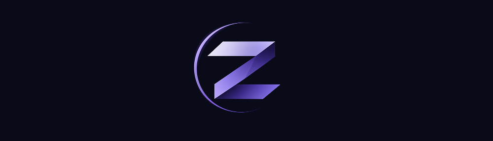

<p align="center">
  
</p>

<p align="center">
  <strong>Ruby UI toolkit with native GPU windows, headless rendering, and a terminal backend</strong>
</p>

<p align="center">
  <a href="https://rubygems.org/gems/zaniah"></a>
  <a href="https://rubygems.org/gems/zaniah"></a>
  <a href="https://github.com/noxdea/zaniah/actions/workflows/main.yml"></a>
  
  <a href="LICENSE.txt"></a>
</p>

<p align="center">
  <a href="#features">Features</a> ·
  <a href="#installation">Installation</a> ·
  <a href="#quick-start">Quick Start</a> ·
  <a href="#platforms">Platforms</a> ·
  <a href="#documentation">Documentation</a>
</p>

---

Zaniah is a pure Ruby UI toolkit for building desktop and terminal interfaces.
It renders through native GPU APIs, a deterministic headless backend, or an ANSI
terminal without extension compilation or a rendering subprocess.

The name comes from the white ground laid before paint or gold leaf: Zaniah is
the drawing surface beneath the editor.

## Features

- Flex, Grid, sticky, absolute, wrapping, and baseline-aware layouts
- Gradients, transforms, paths, SVG, shadows, clipping, and GPU glyph atlases
- Retained element state, subscriptions, and non-blocking background tasks
- Scroll views, inertial input, and uniform or variable-height virtual lists
- OpenType shaping, font fallback, Japanese wrapping, selection, editing, and IME
- Themes, state styles, keyed animation, springs, and reduced-motion support
- Opt-in controls, overlays, tables, trees, charts, forms, and terminal fallbacks
- Spatial keyboard focus and a diffed cross-platform accessibility tree
- F12 inspector, frame statistics, hot reload, and headless golden-image tests
- Native input, IME, clipboard, file-drop, display, and filesystem events
- RBS declarations for the public API

## Installation

Add Zaniah to your Gemfile:

```ruby
gem "zaniah"
```

Then install:

```sh
bundle install
```

### Requirements

- CRuby 3.1 or later
- YJIT recommended

## Quick Start

Create `hello.rb`:

```ruby
require "zaniah"

window = Zaniah::Platform.open_window(
  backend: :headless,
  width: 480,
  height: 240
)
window.text_system = Zaniah::TextSystem::Renderer.new
window.draw do
  Zaniah::Div.new.flex_col.p(24).gap(12).bg("#161b22")
    .child(Zaniah::Text.new("Hello, Ruby", size: 24))
    .child(Zaniah::Text.new("A native toolkit, written in Ruby."))
end
window.tick
window.write_png("hello.png")
window.close
```

Run it to write `hello.png`:

```sh
bundle exec ruby hello.rb
```

For an interactive window, choose `backend: :mac`, `:linux`, `:windows`, or
`:tui`, then call `window.run` instead of `window.tick`.

## Platforms

| Backend | Renderer | Notes |
| --- | --- | --- |
| `:mac` | Metal or OpenGL | Native macOS window |
| `:linux` | Wayland/EGL or X11/GLX | Selected from the current display environment |
| `:windows` | Win32/WGL | Requires 64-bit Ruby and Windows 10 APIs |
| `:headless` | Pure Ruby software renderer | Deterministic rendering and PNG output |
| `:tui` | ANSI terminal | Text-grid rendering and terminal input |

Native backends use the operating system libraries through Ruby's Fiddle. See
[Native backends](docs/native.md) for platform requirements and checks.

## Documentation

- [Native backends](docs/native.md) — windows, displays, file watching, and terminals
- [Text system](docs/text.md) — font discovery, shaping, rasterization, and caching
- [SVG and lists](docs/vector_and_list.md) — static vector icons and virtual lists
- [Layout and scrolling](docs/layout.md) — Grid, ScrollView, sticky positioning, and RTL foundations
- [Themes](docs/theme.md) — semantic tokens and state styles
- [Components](docs/components.md) — controls, overlays, data views, charts, and forms
- [Animation](docs/animation.md) — easing, springs, transitions, and reduced motion
- [Accessibility](docs/accessibility.md) — semantic trees, diffs, and native bridges
- [Terminal UI](docs/tui.md) — deterministic component degradation
- [CPU process workers](docs/process_pool.md) — portable background CPU work
- [Architecture decisions](docs/adr) — design records and rationale
- [RBS declarations](sig) — public API signatures

## Development

```sh
bundle install
bundle exec rake test
bundle exec rake bench
gem build --strict zaniah.gemspec
```

Set `BUDGET=1` to enable benchmark assertions.

## Contributing

Bug reports and pull requests are welcome at
[github.com/noxdea/zaniah](https://github.com/noxdea/zaniah).

## License

Zaniah is released under the [MIT License](LICENSE.txt). Included font notices
remain alongside the font files.
